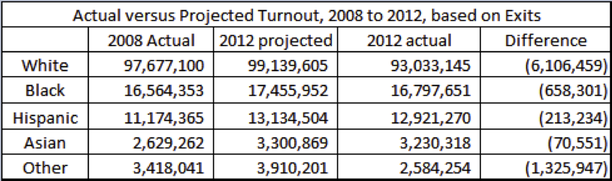

```{r include = FALSE}
library(knitr)
opts_chunk$set(echo = TRUE, comment = "")
```

In this handout, we will learn the first steps of any data analysis: reading in the data and summarizing it.  Also, throughout the semester, we will be looking only at various subsets of the data.  We will learn here how to select data by the subset. 

## Topics and Concepts Covered

- Basic operations on vectors
- Loading in data
- The structure and format of R

## R Commands Covered

- Creating a vector using `c` and accessing its elements using `[` and `]` 
- Basic operations on vectors: `length`, `mean`, `median`, `min`, 
  `max`, `range`, `sum`, `prod`, `log`
- Reading data using `read.csv(..., header = TRUE)` and 
  `read.table(..., header = TRUE)`
- Summarizing the data using `head`, `summary`, and `names`
- Accessing help files using `?` and `??`
- Using `$` to extract columns from a data frame
- Using brackets with two arguments, `[row, column]` to recover elements 
  of a data frame

**Before beginning this handout Do not forget to set your working directory!**

# Working with Vectors  

Before beginning an example from a recent paper in political science, we are going to continue with the data on turnout from the info session.  The data is reprinted below.



## Creating Vectors  

A vector is simply a collection of numbers or strings.  Vectors are 
constructed in R from using the `c` function, which is used to *combine* 
objects into a single vector. We are going to create a set of vectors, 
one for each column in Trende's figure.
```{r }

```

We can recall any element of a vector by using brackets.
```{r }

```
R allows us to perform any number of operations on a vector:
```{r }


```


### Coding Tip  

If you want to access RStudio's help functions, 
click on the 'Help' tab in the lower right hand box, and type in 
your question.  If you want to access help files from the command 
line, type in `?command`, e.g. `?sum` to learn about the `sum` function.
If you do not remember the exact name of a command, type `??summar`
and R will use 'fuzzy matching' to suggest some commands you might be    
looking for.

## Giving Names to a Vector  

Next, we give names to a vector:

```{r }

```

# Example: Disaster Relief Aid and Support for the Incumbent President. 

In this section, we analyze the relationship between disaster relief 
aid and support for the incumbent President's party, from 1988-2004. 
Political economists have long theorized that incumbent political 
leaders may 'buy' votes, through dispensing aid to sub-national political 
units in order to shore up electoral support.  

@Healy.Malhotra2009 examined whether this effect is present in the 
contemporary United States. We are going to conduct an abridged 
version of their study, though the basic findings will be similar. 

The authors explored the relationship between county-level support 
for the incumbent President's party and disaster aid disbursed to 
the county.  Each observation is a county in the United States, observed 
in the four years before five consecutive elections (1988, 1992, 1996, 
2000, and 2004). Like the authors, we are interested in characterizing a 
causal relationship between disaster aid disbursement and support 
for the incumbent party's candidate in the election.

The  dataset `disasteraid.csv` is available as a comma-separated and 
tab-delimited file in the `data` folder. Comma separated files have the 
suffix `.csv`, while tab-delimited files often have the suffix `.tsv` or 
`.txt`.  

The data contains the following variables:

-----------------------------------------------------------------------------
 Name                    Description
 ----------------------- ----------------------------------------------------
 `fips`                  An identifier for each county. This is the level of
                         government that received aid.
 
 `year`                  The year for which the variables are observed.
 
 `incum_vote`            The percent of the vote received by the incumbent's 
                         party for that county in that election. 

 `prev_incum`            The percent of the vote received by the incumbent's 
                         party in the previous election.
                      
 `all_current_irelief`   A measure of disaster aid relief received, per 
                         capita, in the county. 
-----------------------------------------------------------------------------

## Reading Data into R

First, we must load in the data.  Here the data is in the `data` folder net to 
this file.  Sometimes you will need to download it from Blackboard or another
website.

When we read in a file we will follow a *three-step procedure*: 

1. Read it in 
2. Check the first five rows
3. Summarize the data.  

This process will ensure that we have loaded in the data without error.  
The structure is given below.

### Reading in a tab-delimited `.tsv` or `.txt` file.

```{r }


```

### Reading in a comma-separated `.csv` file.

```{r }

```

## Notes

We set the parameter `header` to `TRUE` to let R know that the first row of 
the file should be used to name each column.  To see what happens if we 
get this wrong, try
```{r }

```
Notice how the first row of the data is the column names, while the 
column names are simply `V1` through `V5`.  

We will use lower case names for vectors and variables.  We will use capital letters for data frames, like `Data.disaster`.

When you read in a data frame, it shows up in the upper right hand 
box of RStudio.

## Attributes of Data Frames

So far, we have been looking at a single data frame, `Data.disaster`.  A 
`data.frame` contains one column for each variable, and one row for each 
observation.   Below are some basic operations on data frames.

We can get the names of the columns of the data frames:
```{r }

```

The function `dim` returns a vector with two elements.  The first is the number of rows of a data frame, the second is the number of columns.
```{r }

```

The functions `nrow` and `ncol` return the same information as `dim`.
```{r }

```

We can extract columns of a data frame several different ways.  For 
example, we can use `$` to extract the column directly by name and 
work with it.
```{r }

```
or we can also *take a copy* of the column and work with this new 
variable
```{r }

```

# The Structure of R

So far, we have encountered the following elements when working with R:

- The **script**.  This should contain all of the commands necessary 
  to replicate your analysis, as well as comments explaining the code.

- The **working directory**.  This is the directory from where R will 
  look for data, and to which it will save any objects.

- The **workspace**.  This is the set of all objects in your current 
  R session. 
  
The work space will include variables, vectors, data frames, 
and a history of all commands you've run in this session.  When you close
RStudio, you will be asked if you want to save your work space.  
In general, you will *not* want to.  We save scripts, not the work space.  
(You can change the Preference settings inside RStudio if
you decide you never want to be asked).

# Precept Questions

In 2007 a federal judge ordered New York City (NYC) to overhaul its 
stop-and-frisk program [link](http://www.huffingtonpost.com/2013/09/17/stop-and-frisk-rulings-_n_3942688.html). The program allowed police in NYC to temporarily detain and search pedestrians. For an overview of the program, see the first few pages of @Gelman.etal2007a.

Concerns arose that blacks and Hispanics were being stopped at higher 
rates than whites. We are going to load in and look at some of the 
stop-and-frisk data. The data is large, with 532,911 observations and 
101 variables. We will be looking at a subset of this data. You will find 
the data in the `data` folder. It is called `subset_saf.csv`, so the path 
from the folder where this file is to the data is `data/subset_saf.csv`.  

Please answer the following questions and submit your code following 
the directions in the syllabus.

### Question 1

Read the data into a data frame named `SAF`.  
```{r, solution = TRUE}

```

### Question 2

How many rows and how many columns are in the subset of the data?
```{r, solution = TRUE}

```

### Question 3

What year is the data from?  
```{r, solution = TRUE}

```

### Question 4

What are the youngest and oldest ages?  
```{r, solution = TRUE}

```

### Question 5

Assuming that NYC cops are arresting neither infants nor Yoda, what could be 
going on here instead?

```{asis, solution = TRUE}

```

Often, when you use data for your research, variable names 
and descriptions will be found in a code book.  The code book for the full 
data set can be found [here](http://www.nyclu.org/files/SQF_Codebook.pdf).  

### Question 6

How many different categories of race are considered?  
```{r, solution = TRUE}

```

### Question 7

Is the mean statistic returned from `summary` useful in characterizing the
"average race" of those stopped and frisked?

```{asis, solution = TRUE}

```

### Question 8

Try the command `table(SAF$race)`.  
```{r, solution = TRUE}

```

What do you think the command `table()` does?

```{asis, solution = TRUE}

```

### Question 9

What does the function `getwd` do?  When might this be helpful?

```{asis, solution = TRUE}

```

# References
