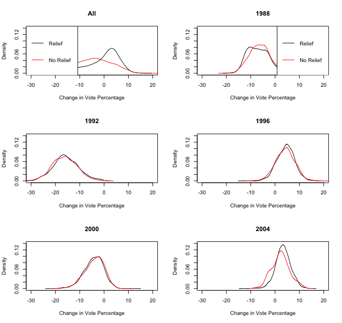

```{r include = FALSE}
library(knitr)
opts_chunk$set(echo = TRUE, comment = "")
```

In this handout, we will learn how to create box plots, as well as how to 
calculate statistics for subsets of the data.  These methods will allow for 
some simple ways to convey information about complex data.

- Creating box-and-whisker plots
- Placing multiple plots on one figure
- Creating tables
- Conditional statements 
- Calculating means by subgroups
- Subsetting data
- Creating box-and-whisker plots through `boxplot`
- Calculating a statistic by groups of data using `tapply`
- Creating variables through using the conditional statement `ifelse`
- Placing multiple plots in one figure by setting `mfrow` with the `par` function

**Before beginning this handout, do not forget to make a new folder for this 
assignment and set your working directory!**

# Introduction to Data

In a recent paper, @Gilligan.Sergenti2008 looked at whether UN interventions 
reduce the length of conflicts. The authors conclude that post-conflict, 
peacetime UN interventions are effective in delaying the onset of the next 
conflict, but that wartime UN interventions do not shorten ongoing conflict. 
We are going to look at the subset of peacetime, post-conflict interventions, 
and try to understand *why* these interventions might be effective. 
Specifically, we are going to show that the impact may be strongest in countries 
that are ethnically homogenous.

First, we read in the data:
```{r }
PeaceData <- read.table("data/PeaceData.txt", header = TRUE)
head(PeaceData)
summary(PeaceData)
```

The data contains the following variables:

-----------------------------------------------------------------------------
 Name                    Description
 ----------------------- ----------------------------------------------------
 `cname`                 The name of each country
 
 `UN`                    1 if a UN intervention occurred; 0 otherwise
 
 `ldur`                  Log number of months until the *next* conflict

 `lwdeaths`              Logged deaths during the last war

 `lwdurat`               Logged length of the last war, in months
 
 `ethfrac`               A measure of ethno-linguistic fractionalization
 
 `logpop`                Logged population size
 
 `continent`             A factor representing which continent the observation
                         came from
-----------------------------------------------------------------------------

# Calculating Statistics for Subsets of the Data

First, we are going to calculate the mean duration until the next conflict, 
by continent.  To do so, we are going to use the command `tapply`. This function 
takes three arguments

- `X`. A variable to which we want to apply a function
- `INDEX`. A variable defining the groups within which we want to apply the function 
- `FUN`. The function we want to apply

For example, if we wanted to calculate the mean duration to conflict by continent, 
we could
```{r }
tapply(PeaceData$ldur, INDEX = PeaceData$continent, FUN = mean)
```

With even a modest number of groups, `tapply` can prove quite useful. 
If we wanted the mean duration to conflict for each country, for countries that 
did and did not experience UN interventions, we would:
```{r }
# Mean for countries w UN intervention
inter1 <- tapply(PeaceData$ldur[PeaceData$UN == 1], 
                 INDEX = PeaceData$continent[PeaceData$UN == 1], 
                 FUN = mean)
inter1

# Mean for countries without a UN intervention
inter0 <- tapply(PeaceData$ldur[PeaceData$UN == 0],
                 INDEX = PeaceData$continent[PeaceData$UN == 0],  
                 FUN = mean)
inter0
inter1 - inter0
```
It appears that the UN did not intervene in any Asian country (as shown by the 
`NA`  under Asia in the first row.  Also, it appears that UN intervention is 
associated with an increase in duration to the next conflict, since the 
differences are all positive  The difference appears largest in the North 
Africa / Middle East `nafrm`.

We can put any function into `tapply` that we like: `sd`, `median`, and so on.  
`tapply` can also be used to calculate the number of observations in each 
category, by setting `FUN = length`. For example
```{r }
tapply(PeaceData$ldur, 
       INDEX = PeaceData$continent, 
       FUN = length)
```

# Conditional Statements

We may also want to create conditional statements.  We do this through the 
command `ifelse`.  The command takes three arguments:

- `test`. A logical expression (one that is either true or false) e.g. `x < 2` 
          or `x == "asia"`.
- `yes`. What to return if the `test` is TRUE
- `no`. What to return if the `test is FALSE

For example, let's say we wanted to create a variable that took on a value of 1 
for observations with high values of ethno-linguistic fractionalization, and a 0 
for observations with low values of ethno-linguistic fractionalization.  We 
could do so using 
```{r }
high.ethfrac <- ifelse(PeaceData$ethfrac > median(PeaceData$ethfrac), 1, 0)
```

We have just created a variable, `high.ethfrac`, which takes on a value of 1 when 
`ethfrac` is above its median, and 0 when `ethfrac` is below its median.  If 
we look at this new variable
```{r }
table(high.ethfrac)
```
we can see that we do have, approximately, half 1's and half 0's.

# Creating Box-and-Whisker Plots

R makes creating box-and-whisker plots straightforward.  The command is 
`boxplot`, and if we place a variable in the function, it returns a box 
plot, as:
```{r}
boxplot(PeaceData$ldur)
```

The function `boxplot` can be used to construct separate boxes for the categories 
of a different variable.  For example, let's say we wanted to look at the box 
plots for countries that did and did not experience a UN intervention:
```{r}
boxplot(PeaceData$ldur ~ PeaceData$UN)
```

It appears, from this simple box plot, that the UN interventions are associated with longer periods of peace. Just like with the density plots from the previous 
handout, we can give the box plot a title and y-axis label, by setting the 
`main` and  and `ylab` parameters to suitable values:
```{r}
boxplot(PeaceData$ldur ~ PeaceData$continent, 
        main = "Duration to Next Conflict, by Continent", 
        ylab = "Duration to Next Conflict, logged" )
```

# Placing Several Plots in One Figure

Finally, we are going to add a command that allows for multiple plots in one figure.  To do so, we need adjust R's default plot parameters.  We'll use the `par` function to
set the value of `mfrow` which controls how plots are arranged in the plotting window.
We use `par` to set `mfrow` like this:

> par(mfrow = c(*number of rows*, *number of columns*))

and we have to remember to put this line *before* (that is, above) any plots we make.

When mfrow is set this way each new plot we make will start in a new part of the 
figure.  To give an example, let's say we wanted to create three box plots in 
a row, where the first contains a box plot of duration by intervention, the next 
contains the same box plot for countries with a high level of ethno-linguistic 
fractionalization (`high.ethfrac == 1`), and the final contains the same box 
plot but only when ethno-linguistic fractionalization is low (`high.ethfrac == 0`). 
```{r}
par(mfrow = c(1, 3)) # One row, three columns

boxplot(PeaceData$ldur ~ PeaceData$UN, 
        main = "All", ylab = "Log Months To Next War")
boxplot(PeaceData$ldur[high.ethfrac == 1] ~ PeaceData$UN[high.ethfrac == 1], 
        main = "Low Ethnic Frac") # High ethfrac countries
boxplot(PeaceData$ldur[high.ethfrac == 0] ~ PeaceData$UN[high.ethfrac == 0], 
        main = "High Ethnic Frac") # Low ethfrac countries
```

We can see from the data that UN interventions are associated with longer times 
of peace (looking at the leftmost figure).  We see that the effect is stronger 
in countries with low ethno-linguistic fractionalization (middle figure) than 
for countries with a high level of ethno-linguistic fractionalization 
(rightmost figure).

# Precept Questions

In these problems, we analyze the relationship between disaster relief aid and 
support for the incumbent President's party, from 1988-2004.  Political 
economists have long theorized that incumbent political leaders may "buy" votes, 
through dispensing aid to sub-national political units in order to shore up 
electoral support.  

@Healy.Malhotra2009 examined whether this effect is present in the contemporary 
United States.  We are going to conduct an abridged version of their study, 
though the basic findings will be similar.  The authors explored the 
relationship between county-level support for the incumbent President's party 
and disaster aid disbursed to the county.  Each observation is a county in the 
United States, observed in the four years before five consecutive elections 
(1988, 1992, 1996, 2000, and 2004).    

We are going to use a subset of the 
authors' original dataset.  Like the authors, we are interested in 
characterizing a causal relationship between disaster aid disbursement and 
support for the incumbent party's candidate in the election.

The dataset `disasteraid.csv` is available as a csv file in the `data` folder 
next to this document. It contains the following variables:

-----------------------------------------------------------------------------
 Name                    Description
 ----------------------- ----------------------------------------------------
 `fips`                  An identifier for each county. This is the level of 
                         government that received aid
 
 `year`                  The year of the variables are observed
 
 `incum_vote`            The percentage of the vote received by the incumbent's 
                         party for that county in that election

 `prev_incum`            The percentage of the vote received by the incumbent's 
                         party in the previous election

 `all_current_irelief`   A measure of disaster aid relief received, per capita, 
                         in the county. 
-----------------------------------------------------------------------------

### Question 1

Read in the data and create a variable, `relief`, that is the treatment 
variable. Create 
this variable such that it is 1 if  `all_current_irelief` is greater than 0, 
and it is 0 if it is less or equal to 0.  
```{r}

```

### Question 2

Next, to measure the difference in support for the incumbent's party, 
create a variable `diff.vote`, that is equal to the incumbent party candidate's 
current vote minus their previous vote. 
```{r}

```

### Question 3

Calculate the difference in means between `diff.vote` for those observations 
for which `relief == 0` and `diff.vote` for those observations for which 
`relief == 1`.  
```{r}

```

### Question 4

What is this difference in these two means?
```{r}

```

### Question 5

Does this difference seem substantively important?  (Hint: The difference 
between Romney and Obama in the 2012 popular vote was 3.9 percent.)  

```{asis}

```

### Question 6

What does this difference imply for the ability of Presidents to buy votes 
(if it is interpreted as causal)?

```{asis}

```

### Question 7

Now generate a table with two rows.  The first row should have the mean of 
`relief` by year and the second should have `diff.vote` by year.  
(You can make the table by just copying directly from the console.)
```{r}

```

### Question 8

Looking at the mean of `diff.vote`, one of the years clearly stands out as 
an outlier.  What occurred in this election that may have affected `diff.vote`? 
(Hint: Use Google or Wikipedia.)

```{asis}

```

### Question 9

Looking at the mean of `relief`, one of the years clearly stands out as an 
outlier.  What occurred between 2000 and 2004 that may have affected this 
variable?  Explain the nature and type of bias, and how this event may be 
biasing the causal effect estimate of `relief` and `diff.vote`.

```{asis}

```

### Question 10

Create a box plot of `all_current_irelief` by year. Next, construct a box plot 
`diff.vote` by year.  
```{r}

```

### Question 11

Was there an event between 2000 and 2004 that affected both disaster relief 
expenditures *and* support for President Bush?  How does this event cast 
doubt on the causal claim the authors are attempting to make?

```{asis}

```

# Example: Multiple Density Plots in One Figure

To provide you with an additional example, we are going to create a figure of density plots.  The density plot will

- Be sized 3 x 2. The upper left corner (the first plot) should use the raw data.  
  The remaining plots should use data from 1988, 1992, 1996, 2000, and 2004,
  respectively
- Each of the six figures should contain two density plots. The first (in black) 
  is the density of `diff.vote` for the observations for which `relief == 1`. 
  The second (in red) should be in the same figure, with the density of 
  `diff.vote` for the observations for which `relief == 0`
- The x-axes and y-axes should be the *same across all plots*
- Each plot should have informative axis labels and titles
- The top two figures should have a legend.  If necessary, you should lengthen 
  the y-axis so that the legend does not overlap with the density plot.

The code for this practice problem is below. You do not have to hand anything 
in here; working through this code will help you with the upcoming problem set. 
Even though the code looks long, please notice that it is basically the same 
bit of code copied six times.  In each instance after the first, the year is 
changed, but the rest remains the same.  Please feel free to copy code from 
one part of your work to the next; there is no reason to retype the code over 
and over.

The output is shown in the Figure after the code.

```{r eval = FALSE}
par(mfrow = c(3, 2))

# Top left figure -- All data
plot(density(diff.vote[(relief == 1)]),
     xlim = c(-30, 20), ylim = c(0, 0.14),
     main = "All", xlab = "Change in Vote Percentage")
lines(density(diff.vote[(relief == 0)]), col = "red")
legend("topleft", c("Relief",  "No Relief"),
       lty = c(1, 1), col = c("black", "red"))

# 1988 data
plot(density(diff.vote[(relief == 1) & (disasteraid$year == 1988)]),
     xlim = c(-30, 20), ylim = c(0, 0.14), main = "1988",
     xlab = "Change in Vote Percentage")
lines(density(diff.vote[(relief == 0) & disasteraid$year == 1988)]), 
      col = "red")
legend("topright", c("Relief",  "No Relief"), 
       lty = c(1, 1), col = c("black", "red"))

# 1992 data
plot(density(diff.vote[(relief == 1) & (disasteraid$year == 1992)]),
     xlim = c(-30, 20), ylim = c(0, 0.14),
     main = "1992", xlab = "Change in Vote Percentage")
lines(density(diff.vote[(relief == 0) & disasteraid$year == 1992)]), 
      col = "red")

# 1996 data
plot(density(diff.vote[(relief == 1) & (disasteraid$year == 1996)]),
     xlim = c(-30, 20), ylim = c(0, 0.14),
     main = "1996", xlab = "Change in Vote Percentage")
lines(density(diff.vote[(relief == 0) & (disasteraid$year == 1996)]), 
      col = "red")

# 2000 data
plot(density(diff.vote[(relief == 1) & (disasteraid$year == 2000)]),
     xlim = c(-30, 20), ylim = c(0, 0.14),
     main = "2000", xlab = "Change in Vote Percentage")
lines(density(diff.vote[(relief == 0) & (disasteraid$year == 2000)]), 
      col = "red")

# 2004 data
plot(density(diff.vote[(relief == 1) & (disasteraid$year == 2004)]),
     xlim = c(-30, 20), ylim = c(0, 0.14),
     main = "2004", xlab = "Change in Vote Percentage")
lines(density(diff.vote[(relief == 0) & (disasteraid$year == 2004)]), 
      col = "red")

# reset mfrow so future plots don't appear in this configuration!
par(mfrow = c(1, 1))
```



# References

